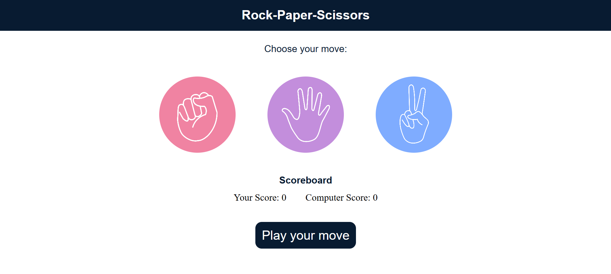
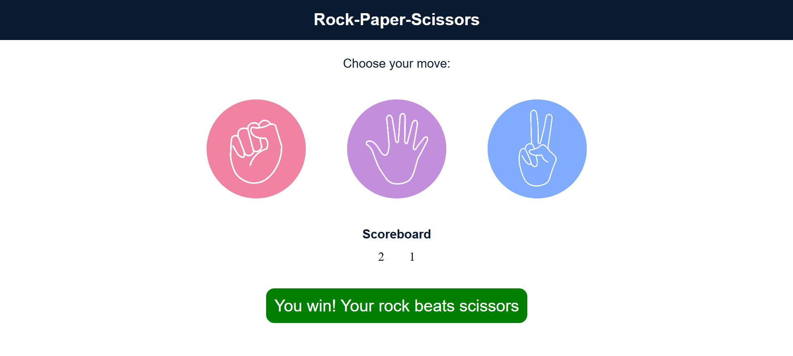
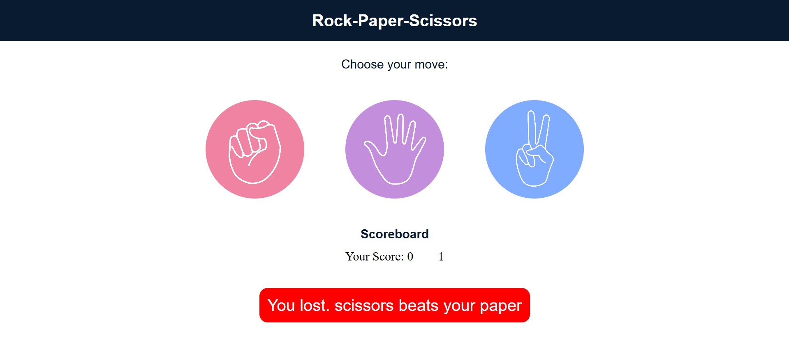
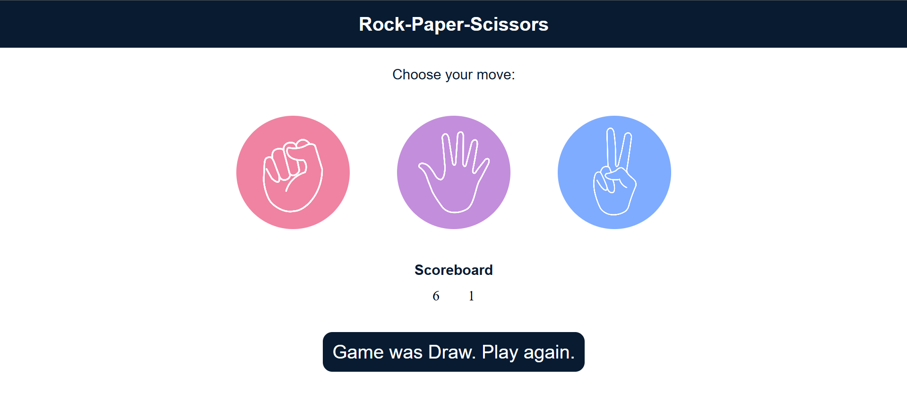

# Rock Paper Scissors Game

A classic Rock-Paper-Scissors game implemented using HTML, CSS, and JavaScript. Play against the computer and see who comes out on top!

## Features

- **Classic Gameplay:** Play Rock, Paper, or Scissors against a computer opponent
- **Scoreboard:** Keeps track of your score and the computer's score
- **Dynamic Messaging:** Provides feedback on game outcomes (win, lose, draw)
- **Responsive Design:** Works well on different screen sizes
- **Clean UI:** Simple and intuitive interface

## Screenshots

| Initial State | User Wins | Computer Wins | Draw |
|---------------|-----------|---------------|------|
|  |  |  |  |

## How to Play

1. Open the `index.html` file in your web browser
2. Choose your move by clicking on the Rock, Paper, or Scissors icon
3. The game will automatically determine the winner and update the scoreboard
4. A message will display the outcome of the round
5. Continue playing to beat the computer!

## Technologies Used

- **HTML5:** For the basic structure of the web page
- **CSS3:** For styling the game interface and making it visually appealing
- **JavaScript (ES6+):** For game logic, handling user interactions, and updating the UI

## Project Structure

```
rock_paper_scissors/
├── index.html       # Main HTML file
├── style.css        # Styling and layout
├── game.js          # Game logic and functionality
├── rock.png         # Rock icon
├── paper.png        # Paper icon
├── scissors.png     # Scissors icon
├── imgs/            # Additional images
└── README.md        # Project documentation
```

## Setup

To run this project locally:

1. **Clone the repository:**
   ```bash
   git clone <your-repository-url>
   ```

2. **Navigate to the project directory:**
   ```bash
   cd rock-paper-scissors
   ```

3. **Open `index.html`:** Simply open the `index.html` file in your preferred web browser

## Program Details

The Rock Paper Scissors game consists of three main files:

- **index.html**: Contains the structure of the game with:
  - A title and instruction text
  - Three choice buttons (Rock, Paper, Scissors) with corresponding images
  - A scoreboard showing user and computer scores
  - A message container for game results

- **style.css**: Provides styling for the game with:
  - A centered layout with appropriate spacing
  - Circular choice buttons with hover effects
  - Scoreboard styling for clear visibility
  - Message container with background color changes for different outcomes

- **game.js**: Implements the core game logic:
  - Generates random computer choices
  - Implements game rules (Rock beats Scissors, Scissors beats Paper, Paper beats Rock)
  - Tracks and updates scores
  - Determines win/loss/draw outcomes
  - Updates the UI based on game results

## Game Rules

- Rock beats Scissors
- Scissors beats Paper
- Paper beats Rock
- Same choices result in a draw

## Future Enhancements

- **Round Limit:** Add an option to play for a set number of rounds
- **Difficulty Levels:** Implement different AI strategies for the computer opponent
- **Sound Effects:** Add audio feedback for wins, losses, and draws
- **Animations:** Add subtle animations for choice selection and result display
- **Local Storage:** Save high scores between sessions

## Contributing

Contributions are welcome! If you have suggestions for improvements or new features, please feel free to:

1. Fork the repository
2. Create a new branch (`git checkout -b feature/your-feature-name`)
3. Make your changes
4. Commit your changes (`git commit -m 'Add new feature'`)
5. Push to the branch (`git push origin feature/your-feature-name`)
6. Open a Pull Request